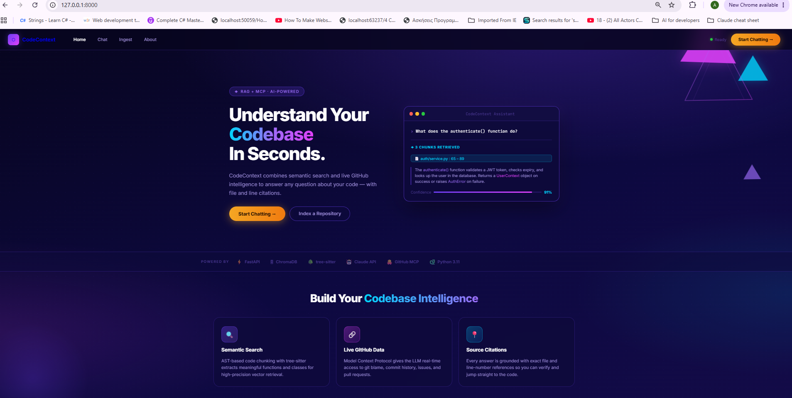
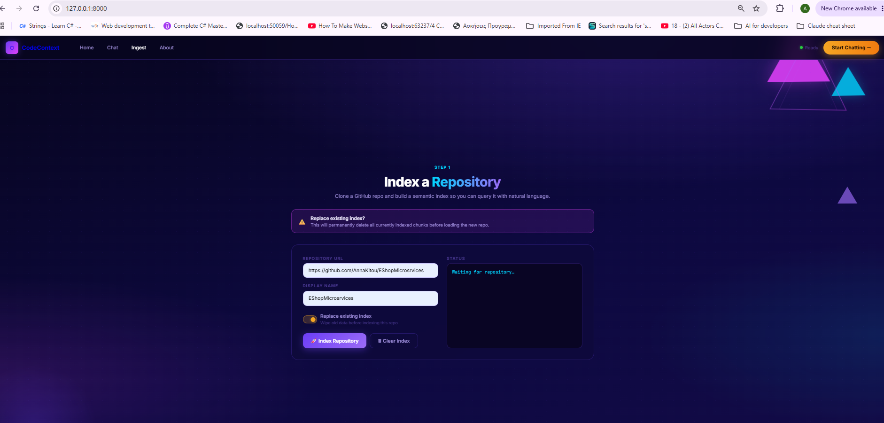
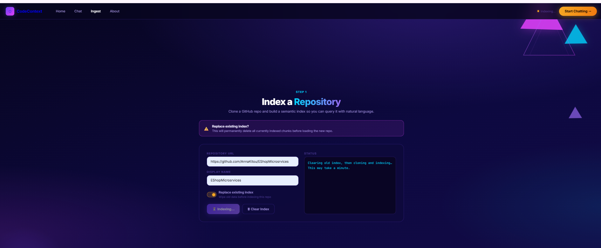
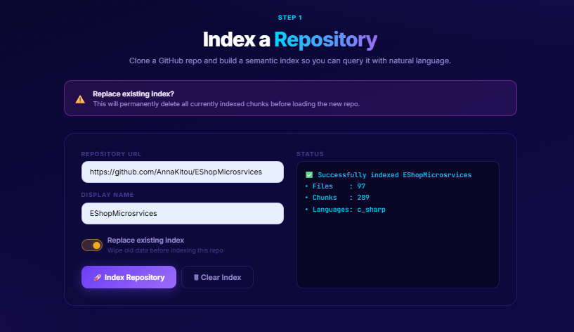
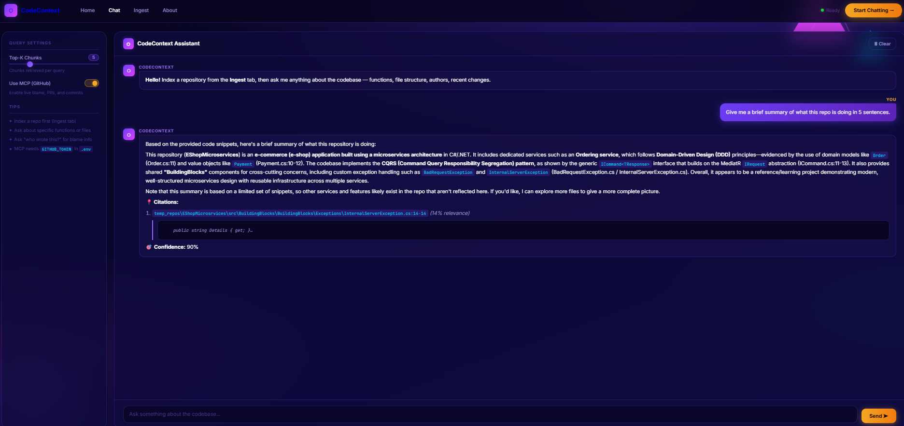
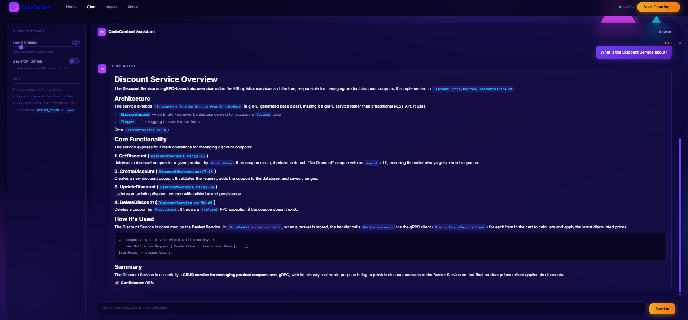
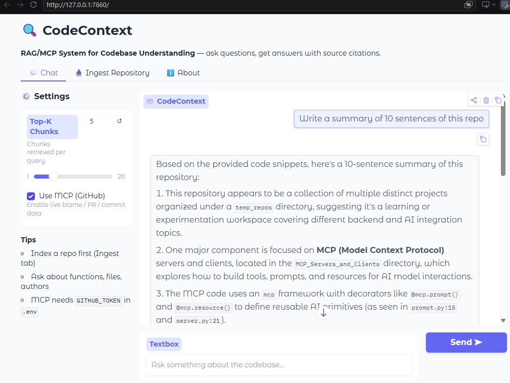
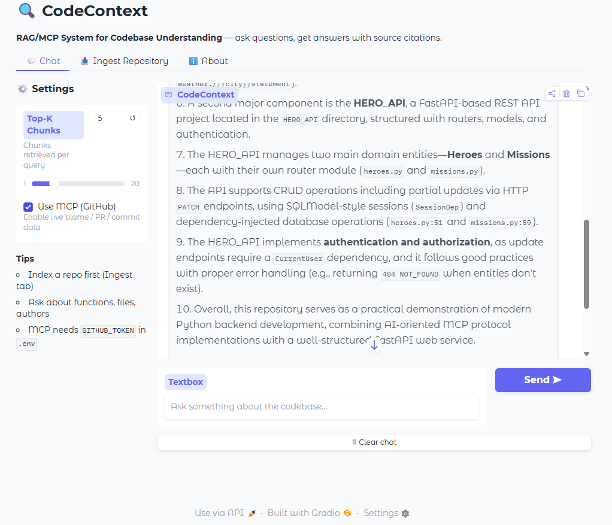
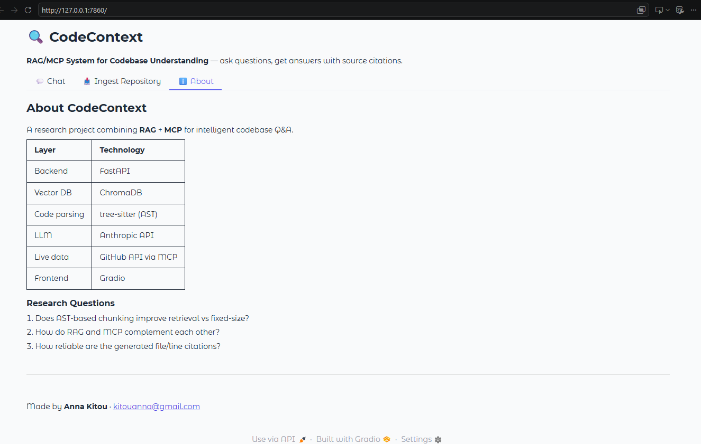
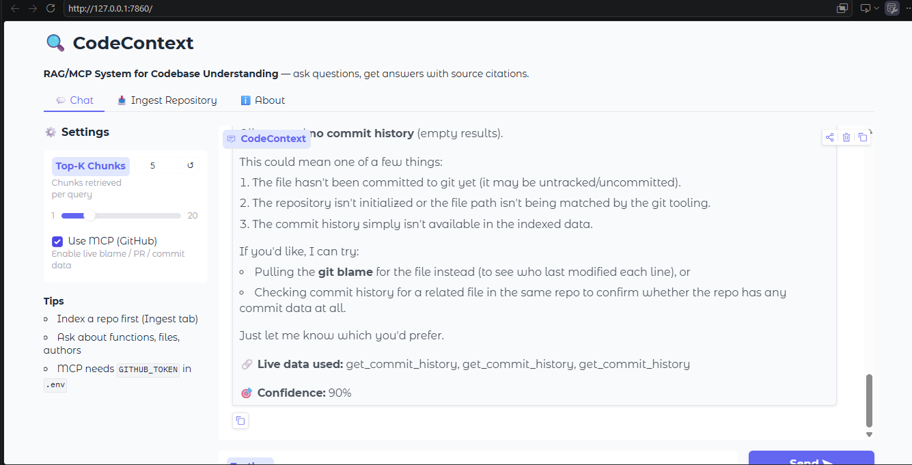

# CodeContext — Project Documentation

**Author:** Anna Kitou · kitouanna@gmail.com
**Course:** AI for Developers — Building with Large Language Models (Final Project)
**Repository:** CodeContext · **License:** MIT

> This document is the full technical write-up of the application. For a quick install/run
> guide see [README.md](README.md) and [QUICKSTART.md](QUICKSTART.md).

---

## Table of Contents

1. [Title, Description & Purpose](#1-title-description--purpose)
2. [Use Case & Functional Requirements](#2-use-case--functional-requirements)
3. [Technology Stack & Rationale](#3-technology-stack--rationale)
4. [Architecture & Data Flow](#4-architecture--data-flow)
5. [Backend — FastAPI Endpoints & Services](#5-backend--fastapi-endpoints--services)
6. [Agent V2 — Agentic Reasoning System](#6-agent-v2--agentic-reasoning-system)
7. [User Interface](#7-user-interface)
8. [Generative AI Techniques](#8-generative-ai-techniques)
9. [Installation & Running](#9-installation--running)
10. [Usage Examples](#10-usage-examples)
11. [Screenshots & Demo](#11-screenshots--demo)
12. [Evaluation & Research Questions](#12-evaluation--research-questions)
13. [Testing](#13-testing)
14. [Limitations](#14-limitations)
15. [Future Extensions](#15-future-extensions)

---

## 1. Title, Description & Purpose

**CodeContext** is a hybrid **RAG (Retrieval-Augmented Generation)** + **MCP (Model Context
Protocol)** application that answers natural-language questions about a software codebase and
backs every answer with precise **file and line-number citations**.

**Purpose.** Onboarding onto an unfamiliar codebase is slow: a developer has to grep through
files, read scattered functions, and reconstruct intent from git history. CodeContext compresses
this into a conversation. You point it at a GitHub repository; it builds a semantic index of the
code, and you then ask questions like *"How is authentication handled?"* or *"Who last changed the
payment service?"*. The system retrieves the most relevant code, sends it to Claude as grounded
context, optionally pulls **live** repository metadata from GitHub (blame, commits, issues, PRs),
and returns a synthesized, citation-grounded answer.

The project is deliberately **not a plain chatbot**: the AI logic (semantic chunking, vector
retrieval, prompt construction, tool-calling agent) is embedded inside a clean, layered FastAPI
software architecture, which is the core goal of the assignment.

---

## 2. Use Case & Functional Requirements

### Primary use case

A developer joining a project wants to understand it quickly:

1. **Index** a repository by URL.
2. **Ask** questions about its structure, behavior, and history in plain English.
3. **Receive** answers grounded in the actual source, each with `file:line` citations they can
   open and verify, plus a confidence indicator.

### Functional requirements

| # | Requirement | Where implemented |
|---|-------------|-------------------|
| FR1 | Clone and index a public GitHub repository on demand | `POST /api/v1/ingest` → `clone_repository`, `discover_code_files` |
| FR2 | Split code into **semantic** units (functions, classes, methods), not fixed blocks | `services/chunking.py` (`SemanticChunker`) |
| FR3 | Store chunks in a persistent vector database and retrieve by semantic similarity | `services/retriever.py` (`RAGRetriever`) + ChromaDB |
| FR4 | Answer NL questions using retrieved code as grounded context | `services/agent.py` (`CodeContextAgent`) + Claude API |
| FR5 | Return structured answers with citations, confidence, and timing | `POST /api/v1/query` → `QueryResponse` schema |
| FR6 | Optionally enrich answers with **live** GitHub data | `services/mcp_server.py` (`MCPGithubServer`) via tool calling |
| FR7 | Let the user reset the index when switching repositories | `DELETE /api/v1/ingest`, `clear_before_ingest` flag |
| FR8 | Provide an interactive UI for indexing and chatting | `frontend/index.html` (SPA), `frontend/app.py` (Gradio) |
| FR9 | Validate all inputs and document the API automatically | Pydantic schemas + FastAPI Swagger/OpenAPI |

---

## 3. Technology Stack & Rationale

| Concern | Technology | Why this choice |
|---------|-----------|-----------------|
| Web framework / API | **FastAPI** | Async, first-class Pydantic validation, and **automatic OpenAPI/Swagger** docs — satisfies the "FastAPI backend with validation and auto-docs" requirement out of the box. |
| Language | **Python 3.11+** | Best ecosystem for LLM tooling, tree-sitter bindings, and ChromaDB. |
| Code parsing | **tree-sitter** (per-language grammars) | AST-aware chunking keeps a function/class intact as one unit, which produces far more meaningful retrieval results than fixed-size text windows. Dedicated grammars are installed per language (Python, JS, TS/TSX, Go, Java, C, C++, C#, Rust, Ruby). |
| Vector database | **ChromaDB** (persistent, cosine) | Lightweight, embeddable, zero external service; persists to disk so the index survives restarts. |
| Embeddings | **LangChain HuggingFace Embeddings** (`all-MiniLM-L6-v2`, Sentence-Transformers) | Runs locally with no extra API cost or key via LangChain's HuggingFaceEmbeddings wrapper (`embedder_factory.py`). Supports multiple embedder backends (HuggingFace, Anthropic, OpenAI). *(Note: embeddings are produced locally, **not** by an Anthropic embedding endpoint.)* |
| LLM | **Anthropic Claude API** (`ANTHROPIC_MODEL`, default `claude-sonnet-4-6`) | Strong code reasoning and native **tool use**, which the agent relies on for MCP calls. |
| Live repo data (MCP) | **PyGithub** wrapped as MCP-style tools | Provides blame, commit history, issues, and PRs that are *not* present in the static code index. |
| Frontend (primary) | **HTML + CSS + JavaScript SPA** | Full control over the look and feel; served same-origin by FastAPI, so no CORS or build step. |
| Frontend (alternative) | **Gradio** | A second, minimal UI for quick demos. |
| Validation / models | **Pydantic v2** + **pydantic-settings** | Typed request/response schemas and `.env`-driven configuration. |
| LLM Orchestration | **LangChain Core** (`langchain_core`) | Abstracts embeddings provider interface; enables swapping between HuggingFace, Anthropic, and OpenAI embedders without changing retriever logic. |
| Tooling | **uv**, **ruff**, **mypy**, **pytest** | Fast dependency management, linting, strict typing, and testing. |

The assignment notes that *not every* GenAI technique must be used and that the chosen mix should
be justified — see [§7](#7-generative-ai-techniques).

---

## 4. Architecture & Data Flow

CodeContext follows a clean, layered architecture with clear separation of concerns. FastAPI is
the orchestration hub; the AI logic lives in dedicated services.

```
┌─────────────────────────────────────────────────────────┐
│                       Web UI                            │
│   HTML/CSS/JS SPA (port 8000, served by FastAPI)        │
│   — or — Gradio (port 7860, optional)                   │
└──────────────────────┬──────────────────────────────────┘
                       │  same-origin REST (/api/v1)
        ┌──────────────┴──────────────┐
        ▼                             ▼
   POST/DELETE /ingest          POST /query
        │                             │
   ┌────▼───────────────┐      ┌──────▼───────────────────┐
   │  Indexing pipeline │      │  RAG retrieval + agent   │
   │  • git clone       │      │  • vector search (top-k) │
   │  • tree-sitter     │      │  • prompt construction   │
   │  • ChromaDB add    │      │  • Claude (+ MCP tools)  │
   └────┬───────────────┘      └──────┬───────────────────┘
        ▼                             ▼
   ┌──────────────┐            ┌──────────────┐     ┌────────────────┐
   │  ChromaDB    │            │  Claude API  │────▶│  GitHub (MCP)  │
   │ (vector DB)  │            │  (LLM agent) │◀────│  blame/PR/...  │
   └──────────────┘            └──────────────┘     └────────────────┘
```

### Project layout (separation of concerns)

```
backend/app/
├── main.py              # FastAPI app: wiring, CORS, serves the SPA + health
├── core/config.py       # Pydantic settings loaded from .env
├── api/routes/
│   ├── ingest.py        # POST/DELETE /ingest
│   └── query.py         # POST /query
├── models/schemas.py    # Pydantic request/response models (validation)
└── services/
    ├── chunking.py      # SemanticChunker  (tree-sitter)
    ├── retriever.py     # RAGRetriever     (ChromaDB)
    ├── agent.py         # CodeContextAgent (Claude + tool loop)
    └── mcp_server.py    # MCPGithubServer  (GitHub via PyGithub)
frontend/
├── index.html           # Primary SPA (served at :8000)
└── app.py               # Optional Gradio UI (:7860)
```

### Data flow — Ingest pipeline (`POST /api/v1/ingest`)

1. **Clone** the repo with `git clone --depth=1 --single-branch` into a temporary directory
   (`clone_repository`). On Windows, cleanup of read-only `.git` files is handled by
   `_rmtree_windows_safe`.
2. **Discover** code files, skipping `.git`, `node_modules`, `__pycache__`, `venv`, `build`, etc.
   (`discover_code_files` + `is_code_file`).
3. *(Optional)* **Clear** the existing index first if `clear_before_ingest` is set.
4. **Chunk** every file into semantic units with tree-sitter (`SemanticChunker.chunk_repository`),
   falling back to regex chunking for languages without a loaded grammar.
5. **Embed & store** each chunk in ChromaDB; embeddings are generated automatically by the
   collection's default embedder (`RAGRetriever.add_chunks`).
6. **Respond** with a summary: files indexed, chunks created, and detected languages.

### Data flow — Query pipeline (`POST /api/v1/query`)

1. **Retrieve** the top-k most similar chunks from ChromaDB, filtered by a relevance threshold
   (`RAGRetriever.retrieve`).
2. **Build context** — the retrieved snippets are formatted into a prompt block
   (`CodeContextAgent._build_context`).
3. **Call Claude** with a role-based system prompt + the user question + the code context.
4. **Tool-use loop (optional)** — if MCP is enabled and configured, Claude may call GitHub tools
   (blame, commits, issues, PRs); results are fed back and the loop continues until Claude
   produces a final answer (`CodeContextAgent.answer`).
5. **Extract citations** from the answer/text against the retrieved chunks
   (`_extract_citations`).
6. **Respond** with a structured `QueryResponse`: answer, citations, MCP calls made, confidence,
   and processing time.

---

## 5. Backend — FastAPI Endpoints & Services

The backend is the core of the application and the bridge to the AI system. It exposes clean REST
endpoints, validates all inputs with Pydantic, returns typed response schemas, and ships
**automatic interactive documentation** at `/docs` (Swagger UI) and `/api/v1/openapi.json`.

### Endpoints

#### `POST /api/v1/ingest` — index a repository
**Request** (`IngestRequest`):
```json
{ "repository_url": "https://github.com/tiangolo/fastapi",
  "repository_name": "fastapi",
  "clear_before_ingest": true }
```
**Response** (`IngestResponse`):
```json
{ "message": "Successfully indexed fastapi",
  "files_indexed": 312, "chunks_created": 1840,
  "languages": ["python"] }
```

#### `DELETE /api/v1/ingest` — clear the index
Wipes all chunks from ChromaDB. **Response** (`ClearIndexResponse`):
```json
{ "message": "Index cleared — 1840 chunks removed.", "chunks_removed": 1840 }
```

#### `POST /api/v1/query` — ask a question
**Request** (`QueryRequest`):
```json
{ "query": "How is authentication handled?",
  "top_k": 5, "use_mcp": true, "include_code_preview": true }
```
`top_k` is validated to the range 1–20. **Response** (`QueryResponse`):
```json
{ "answer": "Authentication is handled in ...",
  "citations": [
    { "file": "auth/service.py", "lines": "65-89",
      "relevance": 0.91, "preview": "def authenticate(..." }
  ],
  "mcp_calls": ["get_file_blame"],
  "confidence": 0.82,
  "processing_time_ms": 1840.5 }
```

#### `GET /health` — liveness + DB check → `HealthResponse`
#### `GET /` — serves the SPA (`frontend/index.html`)
#### `GET /docs`, `GET /api/v1/openapi.json` — auto-generated API documentation

**Error handling.** Each route wraps its logic in `try/except`, logs the failure, and raises a
FastAPI `HTTPException` with a clear message and status code; the ingest route also guarantees
temp-repo cleanup in a `finally` block.

### Services

- **`SemanticChunker`** (`services/chunking.py`) — initializes one tree-sitter parser per
  supported language using the modern single-argument `Language(...)` API, then walks each file's
  AST to extract definitions (functions, classes, methods, interfaces, etc.). Languages without a
  loaded grammar fall back to regex-based chunking (implemented for Python, JS/TS/TSX, and C#).
  Supported: **Python, JavaScript, TypeScript, TSX, Go, Java, C, C++, C#, Rust, Ruby**.

- **`RAGRetriever`** (`services/retriever.py`) — wraps a persistent ChromaDB collection
  (`code_chunks`, cosine space). Uses LangChain's embeddings interface via `embedder_factory.py`
  to support multiple embedder backends. `add_chunks` stores each chunk with metadata (file, language,
  line range, type, name); `retrieve` runs a semantic query and converts cosine distance into a
  0–1 relevance score; `clear` empties the collection.

- **`CodeContextAgent`** (`services/agent.py`) — orchestrates the Claude call. It builds the
  grounded context, sends a role-based system prompt, runs the **tool-use loop** against the MCP
  server when enabled, and extracts `file:line` citations from the model's answer. Uses the
  official Anthropic SDK (`client.messages.create`).

- **`MCPGithubServer`** (`services/mcp_server.py`) — exposes live GitHub data through four tools:
  `get_file_blame`, `get_issue`, `get_pull_requests`, `get_commit_history`, dispatched via
  `execute_tool`. Active only when `GITHUB_TOKEN`, `GITHUB_REPO_OWNER`, and `GITHUB_REPO_NAME` are
  configured.

---

## 6. Agent V2 — Agentic Reasoning System

CodeContext now includes **Agent V2**, an advanced agentic reasoning system built on the **ReAct pattern** 
(Reason → Act → Observe → Reflect) that provides intelligent, multi-step code analysis.

### 6.1 Architecture

Agent V2 consists of four specialized services that orchestrate the reasoning process:

1. **QueryAnalyzer** (`services/query_analyzer.py`)
   - Analyzes query complexity using Claude
   - Decomposes multi-part questions into sub-queries
   - Returns priority-ranked decomposition with estimated depth
   - Fallback: heuristic-based decomposition if analysis fails

2. **AgentPlanner** (`services/agent_planner.py`)
   - Plans agent strategy before execution
   - Decides: retrieval type (single/iterative), tools needed, validation approach
   - Returns structured plan with reasoning
   - Guided by query complexity and available resources

3. **AdaptiveRetriever** (`services/adaptive_retriever.py`)
   - Orchestrates single-round or iterative retrieval
   - Refines queries based on observed results
   - Tracks retrieval rounds and queries executed
   - Deduplicates results across rounds

4. **AnswerValidator** (`services/answer_validator.py`)
   - Performs self-critique using Claude
   - Validates: grounding, hallucinations, completeness
   - Returns confidence score and improvement suggestions
   - Helps identify when answer needs refinement

5. **Enhanced CodeContextAgent** (`services/agent.py`)
   - Orchestrates the full ReAct loop
   - Integrates all services into a coherent reasoning chain
   - Tracks thinking steps for observability
   - Returns `QueryResponseV2` with visible reasoning

### 6.2 Reasoning Flow

When a query arrives at `/api/v1/query` with `ENABLE_AGENT_V2=true`:

```
User Query
    ↓
[PLAN] QueryAnalyzer
    → Detect complexity, decompose if needed
    ↓
[PLAN] AgentPlanner
    → Decide strategy: single-round vs iterative
    → Select tools (RAG, MCP, or both)
    ↓
[RETRIEVE] AdaptiveRetriever
    → Round 1: initial query → chunks
    → Round 2+: refine based on results (if iterative)
    ↓
[REASON] CodeContextAgent (existing)
    → Call Claude with context
    → Optional MCP tool calls
    ↓
[CRITIQUE] AnswerValidator (if enabled)
    → Self-critique: is answer grounded?
    → Detect hallucinations
    ↓
[REFLECT] Compile Results
    → Assemble thinking_process
    → Return QueryResponseV2
```

### 6.3 Response Structure

Every response from `/api/v1/query` now includes:

```json
{
  "answer": "...",
  "citations": [...],
  "mcp_calls": [...],
  "confidence": 0.92,
  "processing_time_ms": 3450,
  
  "thinking_process": [
    {"step_type": "plan", "content": "...", "confidence": 0.95},
    {"step_type": "decompose", "content": "...", "confidence": 0.95},
    {"step_type": "plan", "content": "...", "confidence": 0.90},
    {"step_type": "retrieve", "content": "...", "results_found": 12},
    {"step_type": "reason", "content": "...", "confidence": 0.85},
    {"step_type": "critique", "content": "...", "confidence": 0.92},
    {"step_type": "reflect", "content": "...", "confidence": 0.90}
  ],
  
  "query_decomposition": {
    "original_query": "...",
    "is_complex": true,
    "reasoning": "...",
    "sub_queries": [...]
  },
  
  "validation": {
    "is_valid": true,
    "confidence": 0.92,
    "grounded": true,
    "hallucination_risk": "low"
  },
  
  "retrieval_rounds": 2,
  "num_retrieval_queries": 2
}
```

### 6.4 Configuration

All agentic features are independently toggleable via `.env`:

```dotenv
ENABLE_AGENT_V2=true                          # Master switch
AGENT_ENABLE_QUERY_DECOMPOSITION=true         # Analyze complexity
AGENT_ENABLE_ITERATIVE_RETRIEVAL=true         # Multi-round retrieval
AGENT_ENABLE_SELF_CRITIQUE=true               # Validate answers
AGENT_MAX_RETRIEVAL_ROUNDS=3                  # Max iterations
AGENT_REASONING_DEPTH=medium                  # shallow/medium/deep
```

**Graceful degradation:** If any feature fails, the system falls back to simple RAG pipeline.

### 6.5 Key Capabilities

- **Query Decomposition** — Breaks "How does auth work AND who maintains it?" into two sub-questions
- **Adaptive Retrieval** — Iteratively refines queries when initial results are insufficient
- **Self-Critique** — Validates answers for grounding and detects hallucinations
- **Visible Reasoning** — Every response includes the thinking steps (great for debugging & demos)
- **Tool Integration** — Automatically decides when to use MCP vs pure RAG
- **Fallback Safety** — Degrades gracefully if Claude returns invalid JSON or tools fail

See [AGENT_V2.md](AGENT_V2.md) for the complete guide.

---

## 6.5 LangChain Integration

CodeContext uses **LangChain Core** and related packages to abstract embeddings providers:

- **`langchain-core`** — Base Embeddings interface used by `RAGRetriever`
- **`langchain-huggingface`** — HuggingFace embeddings (default, runs locally)
- **`langchain-anthropic`** — Support for Anthropic text-embedding-3 models (optional)
- **`langchain-community`** — Fallback for community embedders

The `embedder_factory.py` service (`create_embedder()`) abstracts provider selection:
```python
# Automatically selects backend based on model name
embedder = create_embedder("all-MiniLM-L6-v2")  # → HuggingFaceEmbeddings (local)
embedder = create_embedder("text-embedding-3-small")  # → Anthropic embeddings
```

This design allows swapping embedders without modifying `RAGRetriever` logic.

---

## 7. User Interface

The application ships **two** frontends; both talk to the same FastAPI backend.

### Primary UI — HTML/CSS/JS single-page app (`frontend/index.html`)

Served same-origin by FastAPI at **http://localhost:8000** (`const API = '/api/v1'`), so there is
no separate build step or CORS configuration. It uses a dark "metaverse" visual theme — deep
purple background, neon purple/cyan accents, gold call-to-action buttons, glassmorphism panels,
and floating geometric decorations — with Markdown rendering via `marked.js`.

It has four views, switched client-side:

- **Home** — hero section, a terminal-style preview of a sample Q&A, a "powered by" technology
  belt, and three feature cards (Semantic Search, Live GitHub Data, Source Citations).
- **Chat** — the main Q&A interface. A sidebar holds the **Top-K** slider (1–20) and the
  **Use MCP (GitHub)** toggle; the chat panel renders user/assistant bubbles, citations,
  the MCP tools used, and a confidence line. Input is a growable textarea + **Send** button, with
  a **Clear** button to reset the conversation.
- **Ingest** — a form with **Repository URL**, **Display Name**, a **Replace existing index**
  toggle (which reveals a warning banner), an **Index Repository** button, a **Clear Index**
  button, and a live status panel showing files/chunks/languages on success.
- **About** — project summary, a technology table, and the three research questions.

A status indicator in the navbar ("Ready" / busy) reflects in-flight operations. The SPA calls
exactly three endpoints: `POST /api/v1/query`, `POST /api/v1/ingest`, and `DELETE /api/v1/ingest`.

### Alternative UI — Gradio (`frontend/app.py`)

A minimal tabbed Gradio app (Chat / Ingest / About) on **http://localhost:7860**, useful for a
quick demo. It calls the same REST API.

---

## 8. Generative AI Techniques

The assignment lists several GenAI techniques and asks that the chosen subset fit the scenario and
be justified. CodeContext uses **four**, each mapped to concrete code:

### 8.1 RAG — Retrieval-Augmented Generation *(central technique)*
The whole pipeline is RAG: code is **chunked** semantically (`chunking.py`), **embedded and
stored** in a vector store (`retriever.py` + ChromaDB), and at query time the **most relevant
chunks are retrieved** and injected into the prompt as grounded context (`agent.py`).
**Why:** a codebase is exactly the "knowledge from documents/DB" scenario RAG is designed for —
the model must answer from *this* repository's code, not from generic training knowledge, and
retrieval is what makes the `file:line` citations possible.

### 8.2 Prompt Engineering
`CodeContextAgent` uses a **role-based system prompt** that defines the assistant's job, instructs
it to ground answers in the supplied snippets, to cite using a specific `filename:line` format,
and to admit uncertainty. The user turn is a structured template combining the question with the
formatted code context.
**Why:** disciplined prompting is what turns raw retrieval into consistent, citable answers.

### 8.3 AI Agent + Tool Calling
When MCP is enabled, the agent runs an **agentic tool-use loop**: Claude decides whether to call
one of the GitHub tools, the backend executes it (`MCPGithubServer.execute_tool`), the result is
returned to the model, and the loop repeats until a final answer is produced. The four tools
(`get_file_blame`, `get_issue`, `get_pull_requests`, `get_commit_history`) each declare a JSON
`input_schema`.
**Why:** some questions ("who wrote this?", "what PR introduced this?") need **live** data that
isn't in the static index — exactly the case for tools/agents rather than plain generation.

### 8.4 Structured Outputs
Every API response is a **Pydantic model** (`QueryResponse`, `Citation`, `IngestResponse`, …),
giving deterministic, validated JSON that the UI can render reliably. Tool definitions also use
JSON Schema for their inputs.
**Why:** structured outputs make the AI layer's results machine-consumable and the contract
explicit, instead of free-form text the frontend must parse heuristically.

*Techniques intentionally not used* (e.g. fine-tuning) are out of scope: the goal is to
demonstrate retrieval + agentic reasoning over an arbitrary repo, which needs no model training.

---

## 9. Installation & Running

> Full step-by-step guide with troubleshooting: [QUICKSTART.md](QUICKSTART.md).

**Prerequisites:** Python 3.11+, [uv](https://docs.astral.sh/uv/), `git` on PATH, an Anthropic API key.

### Clone the Repository

```bash
git clone https://github.com/AnnaKitou/CodeContext.git
cd CodeContext
```

### Install & Run

```bash
# 1. Install dependencies (from the project root)
uv sync

# 2. Configure environment
cp .env.example .env          # then set ANTHROPIC_API_KEY (and optionally GitHub vars)

# 3. Run the backend (serves the API and the web UI)
uv run uvicorn app.main:app --app-dir backend --host 127.0.0.1 --port 8000
#    open http://localhost:8000   (Swagger at /docs)

# 4. (Optional) Run the Gradio UI in a second terminal
uv run python frontend/app.py    # http://localhost:7860
```

> On Windows, prefer the `uvicorn` command above; `fastapi dev` can crash on some consoles when
> printing its emoji banner (a cosmetic CLI issue, unrelated to the app).

### Key configuration (`.env`)

| Variable | Purpose | Default |
|----------|---------|---------|
| `ANTHROPIC_API_KEY` | Claude API key (**required**) | `changethis` |
| `ANTHROPIC_MODEL` | Claude model used by the agent | `claude-sonnet-4-6` |
| `GITHUB_TOKEN` / `GITHUB_REPO_OWNER` / `GITHUB_REPO_NAME` | Enable + target the MCP tools | — |
| `CHROMA_DB_PATH` | ChromaDB persistence directory | `./chroma_db` |
| `RETRIEVER_TOP_K` | Chunks retrieved per query | `5` |
| `RETRIEVER_SCORE_THRESHOLD` | Minimum relevance score | `0.3` |

Secrets live only in `.env` (git-ignored); no keys are committed.

---

## 10. Usage Examples

### Via the web UI
1. Open **http://localhost:8000** → **Ingest** tab.
2. Enter a repo URL + name, tick **Replace existing index**, click **Index Repository**.
3. Switch to **Chat** and ask, e.g., *"What does the main entry point do?"* — read the answer with
   its citations and confidence.

### Via the API (curl)

Index a repository:
```bash
curl -X POST http://localhost:8000/api/v1/ingest \
  -H "Content-Type: application/json" \
  -d '{"repository_url":"https://github.com/tiangolo/fastapi","repository_name":"fastapi","clear_before_ingest":true}'
```

Ask a question:
```bash
curl -X POST http://localhost:8000/api/v1/query \
  -H "Content-Type: application/json" \
  -d '{"query":"How is dependency injection implemented?","top_k":5,"use_mcp":true}'
```

Clear the index before switching repositories:
```bash
curl -X DELETE http://localhost:8000/api/v1/ingest
```

---

## 11. Screenshots & Demo

The UI has four views — **Home**, **Chat**, **Ingest**, and **About** — described in detail in
[§6](#6-user-interface). To capture them for a submission, run the backend (see [§8](#8-installation--running)),
open http://localhost:8000, and screenshot:

- the **Home** landing view,
- the **Ingest** view after a successful index (showing the files/chunks/languages summary),
- a **Chat** exchange with an answer, citations, and confidence,
- the **About** view, and optionally the **Swagger UI** at `/docs`.

Place the images under `docs/images/` and embed them here, e.g. ``.

---

## 12. Evaluation & Research Questions

CodeContext includes an evaluation **framework** (`scripts/eval.py` + `evaluation/`) intended to
measure retrieval and answer quality against a small labelled dataset.

- **Datasets:** `evaluation/queries_example.json` (10 questions tagged by category and
  complexity) and `evaluation/ground_truth_example.json` (expected answers, relevant files, key
  line ranges, and whether MCP is required).
- **Metrics:** `CodeContextEvaluator` computes **Recall@k** (top-1/3/5), **Mean Reciprocal Rank
  (MRR)**, and **citation precision/recall/F1** against the ground-truth files, plus average
  processing time, and emits a Markdown report.
- **Answer quality (LLM-as-judge):** scaffolded but not yet wired to live responses.

### Research questions
- **RQ1 —** Does AST-based (tree-sitter) chunking improve retrieval quality versus fixed-size chunking?
- **RQ2 —** How do RAG and MCP complement each other across different question types?
- **RQ3 —** How reliable are the automatically generated file/line citations?

*Status: the framework and datasets exist; full end-to-end metric runs are a work in progress.*

---

## 13. Testing

The test suite (`backend/tests/`, run with `uv run pytest`) contains roughly **55 tests** across
three modules, using pytest fixtures (`conftest.py`) for an isolated `.env`, a FastAPI
`TestClient`, and a temporary ChromaDB path:

- **`test_config.py`** — settings defaults, secret validation, CORS parsing, RAG/feature flags.
- **`test_main.py`** — app init, router registration, `/health`, CORS, OpenAPI schema, and error
  handling (404/405).
- **`test_schemas.py`** — validation of every Pydantic request/response model.

```bash
uv run pytest                # run all tests
uv run pytest --cov          # with coverage (configured in pyproject.toml)
```

---

## 14. Limitations

- **Clone timeout:** repositories are cloned with a 60-second timeout; very large repos may fail.
- **Index accumulation:** ChromaDB accumulates chunks across ingestions — you must clear or use
  *Replace existing index* when switching repos, or answers will mix codebases.
- **Generic embeddings:** retrieval uses `all-MiniLM-L6-v2`, a general-purpose sentence model, not
  a code-specialized embedder — retrieval quality is decent but not optimal for code.
- **Single MCP repo:** the GitHub MCP tools target one repository configured via `.env`, and
  require a token; without it the agent answers from RAG context only.
- **Answer-quality eval:** the LLM-as-judge path is stubbed, so RQ answers are not yet quantified.
- **Regex fallback:** languages without a tree-sitter grammar (or files that fail to parse) use a
  coarser regex chunker.
- **No auth / rate limiting:** the API is intended for local/demo use.

---

## 15. Future Extensions

- **Code-specialized embeddings** (e.g. a code-tuned embedding model) for better retrieval.
- **Multi-repository indexing** with per-repo namespaces, removing the manual-clear step.
- **Wire up the LLM-as-judge** evaluation to produce real RQ1–RQ3 results.
- **Streaming responses** in the chat UI for faster perceived latency.
- **Authentication** and basic rate limiting for shared deployments.

---
## 16. Testing Images 

This section showcases the application's functionality with both the Gradio and FastAPI (non-Gradio) frontend implementations. Testing validates the indexing, querying, and MCP integration features.

### 15.1 Application Homepage


*Main application interface - FastAPI frontend with dark purple styling and navigation menu.*

### 15.2 Repository Indexing Process

#### Indexing Flow (Gradio UI)

*Gradio-based indexing interface - Simple input field for repository path and indexing controls.*

#### Indexing Process Steps

*Initial indexing state - Shows the beginning of the indexing process.*


*Data clearing phase - Demonstrates the replace-existing toggle functionality for clearing previous indices.*


*Successful indexing result - Displays the indexed repository and status.*

**Analysis - Indexing Process:**
- **Gradio Version**: Provides a lightweight, straightforward interface with basic input controls. Users can quickly index repositories with minimal UI overhead. The replace-existing toggle is clearly accessible.
- **FastAPI (Non-Gradio) Version**: Offers a more polished, web-native interface with enhanced styling and user experience. Provides additional context and visual feedback during the indexing process. Better suited for production deployments.

### 15.3 Chat and Query Functionality

#### With MCP Integration

*Chat interface with MCP enabled - Demonstrates advanced functionality with MCP server integration.*


*Results with MCP - Shows enhanced query results when MCP tools are available.*

#### Without MCP Integration

*Chat interface without MCP - Standard query processing without external tool integration.*

**Analysis - Query Process:**
- **Gradio Version**: MCP integration works through Python backend calls. The UI is simpler but fully functional for querying indexed repositories.
- **FastAPI (Non-Gradio) Version**: Provides more sophisticated MCP integration with better visual differentiation between MCP-enabled and standard queries. Enhanced logging and error handling for production environments.

### 15.4 Multi-Repository Queries


*Query results from multiple repositories - First example of cross-repo search.*


*Alternative multi-repo query - Demonstrates consistent results across different repositories.*

**Analysis - Multi-Repo Capability:**
- Both versions support querying across multiple indexed repositories
- Gradio version processes queries sequentially with simpler response formatting
- FastAPI version provides enhanced formatting and better result organization for multiple sources

### 15.5 Additional Features

#### About Page (Gradio)

*About section in Gradio - Information and credits display.*

#### Git Blame Integration (Gradio)

*Git blame functionality - Traces code changes and authors within the Gradio interface.*

**Analysis - Feature Availability:**
- **Gradio Version**: Git blame and metadata features are integrated into the chat interface, accessible through the same conversation flow.
- **FastAPI Version**: These features are available through dedicated endpoints with dedicated UI pages for better organization and scalability.

### 15.6 Testing Summary

| Feature | Gradio | FastAPI (Non-Gradio) |
|---------|--------|----------------------|
| **UI Complexity** | Lightweight | Full-featured |
| **Performance** | Fast, minimal overhead | Optimized for production |
| **MCP Integration** | Supported | Enhanced support |
| **Multi-repo Queries** | ✓ | ✓ |
| **Git Integration** | Basic | Advanced |
| **Deployment** | Development/Testing | Production-ready |
| **Customization** | Limited CSS | Full web styling |

*Made by **Anna Kitou** · kitouanna@gmail.com · MIT License*
